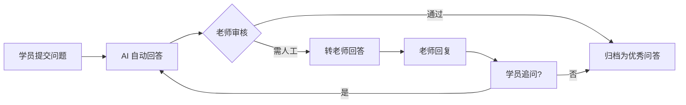
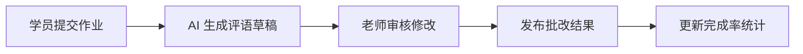

## 1. 产品概述

AI 课程助教 Web 平台是一款面向培训机构老师的智能教学辅助工具，通过 AI 技术帮助老师高效管理学员提问、批改作业、追踪学习进度，从而提升教学效率和学员体验。

- 核心目标：减轻教师重复性工作负担，提供智能化的教学辅助
- 目标用户：培训机构授课老师、教学管理人员
- 产品价值：7x24 小时智能答疑、自动作业批改、数据化学情分析

## 2. 核心功能

### 2.1 用户角色

| 角色 | 登录方式 | 核心权限 |
|------|----------|----------|
| 教师 | 账号登录 | 全部功能：课程管理、提问处理、作业批改、数据分析、系统设置 |

### 2.2 功能模块

1. **课程空间**：课程列表、资料导入、课程管理
2. **提问广场**：学员提问列表、AI 自动回答、人工转答、追问记录、内容审核
3. **作业批改**：作业列表、AI 评语草稿、批改标记、完成率统计
4. **知识卡片**：知识点管理、掌握情况标记、复习推荐、优秀问答沉淀
5. **班级报告**：高频困惑统计、完成率对比、辅导建议导出、学情分析

### 2.3 页面详情

| 页面名称 | 模块名称 | 功能描述 |
|----------|----------|----------|
| 课程空间 | 课程卡片列表 | 展示所有课程，支持搜索和筛选 |
| 课程空间 | 课程详情 | 课程信息、资料上传、学员列表 |
| 课程空间 | 资料导入 | 支持按课程导入教学资料，供 AI 学习 |
| 提问广场 | 提问列表 | 展示所有学员提问，支持按状态/课程筛选 |
| 提问广场 | AI 回答 | 自动生成常见问题回答，支持调整回答语气 |
| 提问广场 | 转老师功能 | 将疑难问题标记为待人工回答 |
| 提问广场 | 追问记录 | 查看学员的追问历史对话 |
| 提问广场 | 内容屏蔽 | 标记并屏蔽不适合内容 |
| 作业批改 | 作业列表 | 按课程展示作业及完成情况 |
| 作业批改 | AI 评语 | 自动生成作业评语草稿，支持编辑修改 |
| 作业批改 | 批改标记 | 标记作业对错、打分、写评语 |
| 知识卡片 | 知识点列表 | 按课程分类的知识点卡片 |
| 知识卡片 | 掌握标记 | 标记学员知识点掌握程度（掌握/薄弱/未学习） |
| 知识卡片 | 复习推荐 | 智能推荐需要复习的知识卡片 |
| 知识卡片 | 优秀问答 | 沉淀优质问答作为知识卡片 |
| 班级报告 | 高频困惑 | 统计班级高频问题和困惑点 |
| 班级报告 | 完成率对比 | 对比各班级作业完成率 |
| 班级报告 | 辅导建议 | 自动生成个别辅导建议并支持导出 |
| 班级报告 | 学情总览 | 班级整体学习情况数据看板 |

## 3. 核心流程

### 3.1 学员提问处理流程

学员提交问题 → AI 自动检索资料并生成回答 → 老师审核回答 → 若回答满意则归档 → 若疑难则转人工回答 → 学员追问则继续对话

### 3.2 作业批改流程

学员提交作业 → AI 生成评语草稿 → 老师审核修改 → 发布批改结果 → 统计完成率

## 4. 用户界面设计

### 4.1 设计风格

- **主色调**：深海蓝 (#1e3a5f) — 代表专业、稳重的教育氛围
- **辅助色**：琥珀橙 (#f59e0b) — 用于高亮、提醒和行动按钮
- **成功色**：翠绿 (#10b981) — 表示掌握、完成、正确
- **警示色**：玫红 (#ef4444) — 表示薄弱、错误、待处理
- **中性色**：石板灰系列 — 用于文本和背景

- **字体**：标题使用 "Noto Serif SC" 衬线体体现学术感，正文使用 "Noto Sans SC" 保证可读性
- **布局风格**：左侧导航 + 顶部工具栏 + 主内容区的经典后台布局
- **卡片风格**：圆角 12px，柔和阴影，悬停微浮起效果
- **图标风格**：线性图标，统一 24px 尺寸

### 4.2 页面设计概览

| 页面名称 | 模块名称 | UI 元素 |
|----------|----------|----------|
| 课程空间 | 课程卡片网格 | 卡片式布局，封面图 + 课程名 + 学员数 + 进度条 |
| 提问广场 | 问题列表 | 列表式布局，标签分类，状态徽标，展开详情 |
| 作业批改 | 作业看板 | 列视图，待批改/批改中/已完成三列拖拽 |
| 知识卡片 | 卡片瀑布流 | 交错布局，卡片翻转效果，掌握度色标 |
| 班级报告 | 数据看板 | 图表 + 数据卡片 + 趋势图，响应式网格 |

### 4.3 响应式

- 桌面端优先设计（1280px+）
- 平板端适配（768px-1279px）：侧边栏可收起
- 移动端（< 768px）：底部导航栏，单列布局

### 4.4 动效设计

- 页面切换：淡入 + 轻微上移动画
- 卡片悬停：y 轴 -4px，阴影加深
- 数据加载：骨架屏脉冲动画
- 状态变更：颜色渐变过渡
