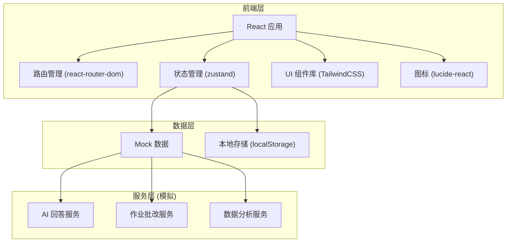
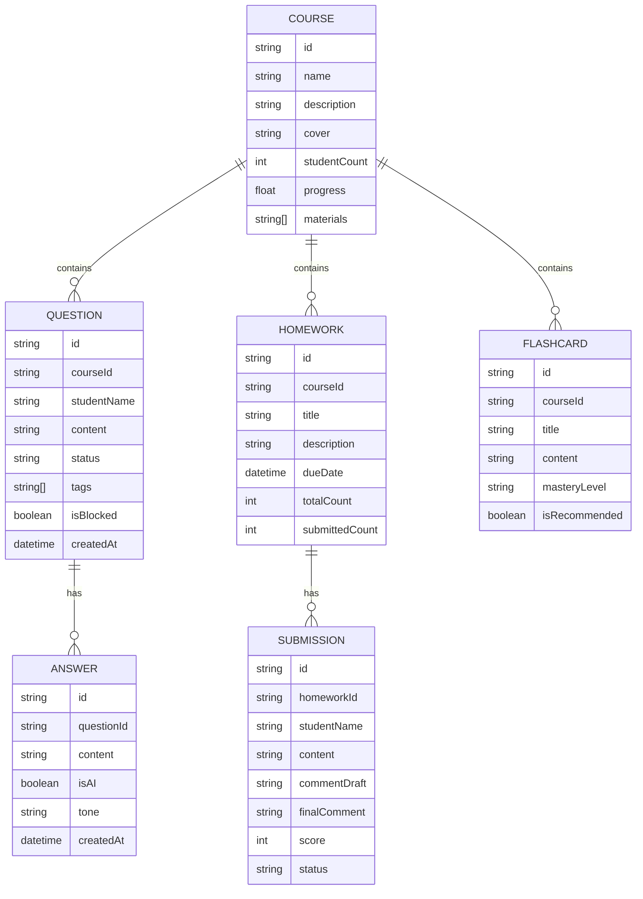

## 1. 架构设计



## 2. 技术选型说明

- **前端框架**：React@18 + TypeScript
- **构建工具**：Vite@5
- **路由管理**：react-router-dom@6
- **状态管理**：zustand@4
- **样式方案**：TailwindCSS@3
- **图标库**：lucide-react
- **数据方案**：Mock 数据 + localStorage 持久化
- **后端**：纯前端项目，使用 Mock 数据模拟 API

## 3. 路由定义

| 路由路径 | 页面名称 | 说明 |
|----------|----------|------|
| / | 课程空间 | 首页，展示课程列表 |
| /courses | 课程空间 | 课程列表及管理 |
| /questions | 提问广场 | 学员提问及 AI 回答 |
| /homework | 作业批改 | 作业列表及批改功能 |
| /flashcards | 知识卡片 | 知识点卡片及复习 |
| /reports | 班级报告 | 数据分析及报告 |
| /settings | 系统设置 | 回答语气、内容屏蔽等设置 |

## 4. 目录结构

```
src/
├── components/         # 通用组件
│   ├── Layout/         # 布局组件（侧边栏、顶栏）
│   ├── Card/           # 卡片组件
│   ├── Modal/          # 弹窗组件
│   ├── Tabs/           # 标签页组件
│   └── Table/          # 表格组件
├── pages/              # 页面组件
│   ├── Courses/        # 课程空间
│   ├── Questions/      # 提问广场
│   ├── Homework/       # 作业批改
│   ├── Flashcards/     # 知识卡片
│   └── Reports/        # 班级报告
├── store/              # 状态管理 (zustand)
│   ├── useCourseStore.ts
│   ├── useQuestionStore.ts
│   ├── useHomeworkStore.ts
│   ├── useFlashcardStore.ts
│   └── useReportStore.ts
├── data/               # Mock 数据
│   ├── courses.ts
│   ├── questions.ts
│   ├── homework.ts
│   ├── flashcards.ts
│   └── reports.ts
├── types/              # TypeScript 类型定义
│   └── index.ts
├── utils/              # 工具函数
│   ├── ai.ts           # AI 相关模拟函数
│   ├── export.ts       # 导出功能
│   └── format.ts       # 格式化工具
├── App.tsx
├── main.tsx
└── index.css
```

## 5. 数据模型

### 5.1 数据模型定义



### 5.2 核心类型定义

```typescript
// 课程
interface Course {
  id: string;
  name: string;
  description: string;
  cover: string;
  studentCount: number;
  progress: number;
  materials: string[];
  createdAt: string;
}

// 问题
interface Question {
  id: string;
  courseId: string;
  studentName: string;
  studentAvatar?: string;
  content: string;
  status: 'pending' | 'ai_answered' | 'teacher_answered' | 'transferred' | 'blocked';
  tags: string[];
  isBlocked: boolean;
  createdAt: string;
  answers: Answer[];
  followUpCount: number;
}

// 回答
interface Answer {
  id: string;
  questionId: string;
  content: string;
  isAI: boolean;
  tone: 'formal' | 'friendly' | 'encouraging';
  createdAt: string;
  authorName?: string;
}

// 作业
interface Homework {
  id: string;
  courseId: string;
  title: string;
  description: string;
  dueDate: string;
  totalCount: number;
  submittedCount: number;
  averageScore?: number;
}

// 作业提交
interface Submission {
  id: string;
  homeworkId: string;
  studentName: string;
  content: string;
  commentDraft: string;
  finalComment: string;
  score: number | null;
  status: 'submitted' | 'grading' | 'graded';
  submittedAt: string;
}

// 知识卡片
interface Flashcard {
  id: string;
  courseId: string;
  title: string;
  front: string;
  back: string;
  masteryLevel: 'mastered' | 'learning' | 'weak' | 'not_started';
  isRecommended: boolean;
  isStarred: boolean;
  tags: string[];
  lastReviewed?: string;
}

// 报告数据
interface ReportData {
  courseId: string;
  totalQuestions: number;
  aiAnsweredRate: number;
  homeworkCompletionRate: number;
  averageScore: number;
  topConfusions: { topic: string; count: number }[];
  studentProgress: { name: string; progress: number; needsHelp: boolean }[];
}

// 设置
interface Settings {
  answerTone: 'formal' | 'friendly' | 'encouraging';
  contentFilterEnabled: boolean;
  blockedKeywords: string[];
  autoAnswerEnabled: boolean;
}
```

## 6. 核心功能实现思路

### 6.1 AI 自动回答
- 使用模拟函数根据课程资料生成回答
- 支持三种语气切换：正式、友好、鼓励
- 回答内容与问题相关度通过关键词匹配算法模拟

### 6.2 作业评语生成
- 根据作业内容和得分模拟生成评语草稿
- 支持老师编辑和修改评语
- 评语模板根据分数段自动匹配

### 6.3 知识卡片推荐
- 基于掌握程度和最后复习时间计算推荐权重
- 薄弱知识点优先推荐
- 支持艾宾浩斯遗忘曲线模拟推荐算法

### 6.4 数据统计
- 高频困惑统计：按标签/关键词聚合计数
- 完成率对比：多课程/多班级横向对比
- 辅导建议：根据学习数据自动生成个性化建议

### 6.5 导出功能
- 支持导出为文本/JSON 格式
- 辅导建议报告支持复制和下载
